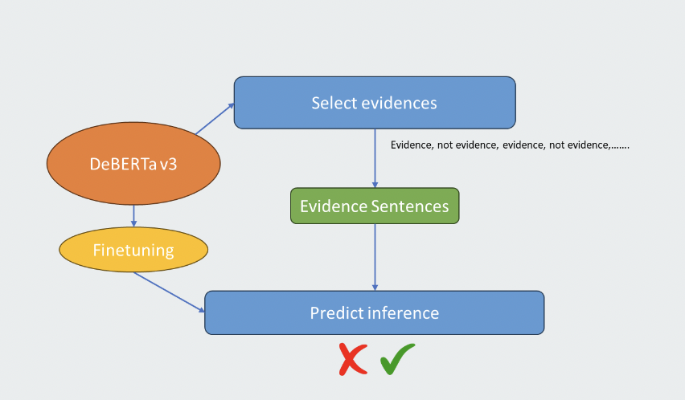
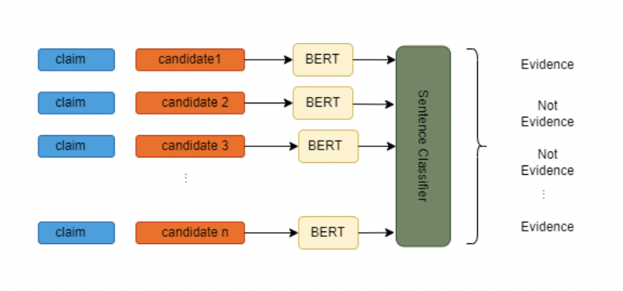
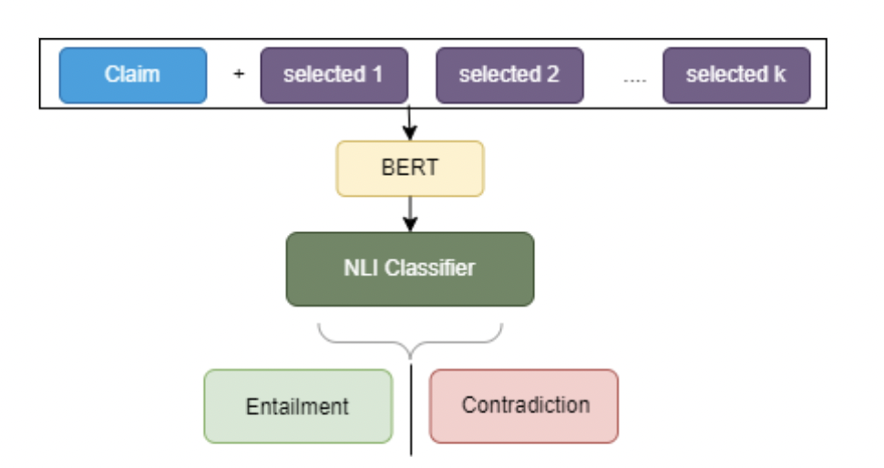

# CSE 635 Project - LLMs in Health Sciences
Team Name - Context Clan
Team Members 
- Leela Srija Alla
    - UBIT Name: lalla
- Vishnu Teja jampala
    - UBIT NAME: vjampala  

## Example Training Data CTR
```json
{
    "Clinical Trial ID": "NCT01537029",
    "Intervention": [
        "INTERVENTION 1: ",
        "  Doxorubicin and Cyclophosphamide",
        "  Doxorubicin: Dosed by the patient's treating physician according to local standard of care.",
        "  Cyclophosphamide: dosage form: IV, Dosage, frequency, and duration: According to local standard of care"
    ],
    "Eligibility": [
        "Inclusion Criteria:",
        "  WHO performance status 0 or 1",
        "Exclusion Criteria:",
        "  Participants unwilling to comply with study procedures.",
        "  CrCl < 10 ml/min"
    ],
    "Results": [
        "Outcome Measurement: ",
        "  Clearance (Cl) for Doxorubicin and Cyclophosphamide",
        "  Time frame: 0-48 hours",
        "Results 1: ",
        "  Arm/Group Title: Doxorubicin and Cyclophosphamide",
        "  Arm/Group Description: Doxorubicin: Dosed by the patient's treating physician according to local standard of care."
        
    ],
    "Adverse Events": [
        "Adverse Events 1:",
        "  Total: 0/15 (0.00%)"
    ]
}
```

## Training Data Labels
### Single
```json
   "40f1d3ce-2ff8-4177-9b11-0bf10b7f6591": {
        "Type": "Single",
        "Section_id": "Results",
        "Primary_id": "NCT00259090",
        "Statement": "the primary trial studies the impact of Fulvestrant, Anastrozole on Oestrogen Receptor H-score.",
        "Label": "Entailment",
        "Primary_evidence_index": [
            1
        ]
    }
```

### Comparison
```json
  "20545360-b2a1-4be9-997a-97040866b239": {
        "Type": "Comparison",
        "Section_id": "Eligibility",
        "Primary_id": "NCT00880464",
        "Secondary_id": "NCT00458237",
        "Statement": "Patients with AIDS are eligible for both the secondary trial and the primary trial.",
        "Label": "Contradiction",
        "Primary_evidence_index": [
            14,
            18
        ],
        "Secondary_evidence_index": [
            12,
            26
        ]
    }
```
## Architecture of Model


### Evidence Selection


### Entailment Task


#Code Execution
## Baseline Model Implementations

We considered three Large Language Models (LLMs) and Sebis as our baseline models. The files are provided in the directory `./src/code/milestone_2`.

### LLM Notebooks

- **biobert-base-cased-v1-2-results.ipynb**
- **deberta-v3-small-mnli-fever-docnli-ling-2c-results.ipynb**
- **debertav3small-nli4ct_results.ipynb** 

These notebooks utilize CSV files located in `/data/Training Data csv.zip`.

#### CSV File Paths

The paths specified in the above notebooks need to be updated when reading the following files:
- `train_hypothesis_evidences.csv`
- `dev_hypothesis_evidences.csv`
- `Numerical_Statements_hypothesis_evidences.csv`
- `Non_Numerical_Statements_hypothesis_evidences.csv`
- `Single_hypothesis_evidences.csv`
- `Comparison_hypothesis_evidences.csv`
- `AdverseEvents_hypothesis_evidences.csv`
- `Results_hypothesis_evidences.csv`
- `Eligibility_hypothesis_evidences.csv`
- `Intervention_hypothesis_evidences.csv`

Additionally, the paths to save `.pt` files in these notebooks should also be changed accordingly.

### Sebis Notebooks

- Pipeline Model -**notfinetuned-pipeline-whole_results.ipynb**
- Joint Model - **sebis-joint-debertav3.ipynb**

These notebooks use files located in `Training DATA json.zip`.

#### JSON File Paths

The paths to `.json` files in the above two notebooks should be updated as needed.

## Fine-tuned Models
 
The finetuned models are provided in the directory `./src/code/milestone_3`.

For finetuning - 
- Us the code in `./src/code/milesone_3/finetuned-deberta-v3-small-drop.ipynb`.
- Save the `model.safetensors` and 'config.json` after running this and use this model in Sebis. 


 ### Sebis finetuned Notebooks

- Finetuned with Dataset 1 - **finetuned-pipeline-results-small-dataset.ipynb**
- Finetuned with Dataset 2 - **finetuned-pipeline-results-large-dataset.ipynb**

These notebooks use files located in `Training DATA json.zip`.

### JSON File Paths

The paths to `.json` files in the above two notebooks should be updated as needed.
